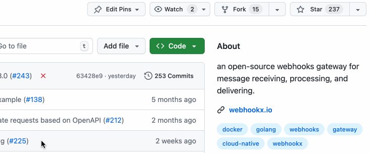

# WebhookX

[](https://github.com/webhookx-io/webhookx/releases) [](https://github.com/webhookx-io/webhookx/actions/workflows/test.yml) [](https://github.com/webhookx-io/webhookx/actions/workflows/lint.yml) [](https://codecov.io/gh/webhookx-io/webhookx) [](https://github.com/avelino/awesome-go)

[](https://join.slack.com/t/webhookx/shared_invite/zt-3ekjrpig4-1T~kOq8aUh7XXA5xiSGtXw) [](https://twitter.com/intent/follow?screen_name=WebhookX)

WebhookX is an open-source webhook gateway for receiving, validating, transforming, and delivering events at scale.

**Docs:** https://docs.webhookx.io  
**OpenAPI:** https://openapi.webhookx.io


## Architecture

<p align="center">

</p>

## Posts

- [Introducing WebAssembly Plugin](https://docs.webhookx.io/blog/engineering/introducing-webassembly-plugin)
- [Function: A Way of Handling Webhook Verification Chaos](https://docs.webhookx.io/blog/engineering/function-a-way-of-handling-webhook-verification-chaos)


## Features

- **Admin API:** RESTful management API on port `:9601`.
- **Reliable delivery:** Automatic retries with configurable delays.
- **Fan out:** Route events to multiple endpoints based on event type.
- **Rate limiting:** Protect ingestion and delivery from overload.
- **Declarative configuration:** GitOps-friendly configuration files.
- **Multi tenancy:** Workspace isolation for configuration entities.
- **Plugins:** Extensible inbound and outbound processing.
- **Observability:** OpenTelemetry metrics and tracing.
- **Secret management:** Reference secrets from external providers.

**Built-in plugins**
- `webhookx-signature`: Sign outbound requests with HMAC (SHA-256)  by adding `Webhookx-Signature` and `Webhookx-Timestamp` headers.
- `wasm`: Transform outbound requests using AssemblyScript, Rust, or TinyGo. See `plugins/wasm`.
- `function`: Customize inbound behavior with JavaScript (signature verification or request body transformation).
- `event-validation`: Validate event data against JSON Schema.
- Security Plugins: `hmac-auth`, `basic-auth`, `key-auth`, `connect-auth`.


## Installation

The WebhookX binary includes both server and CLI command.

### macOS

```shell
brew tap webhookx-io/webhookx && brew install webhookx
```

### Linux | Windows

Download the binary distribution on [releases](https://github.com/webhookx-io/webhookx/releases).

## Get started

> [!TIP]
> This quick start is for evaluation only. For production deployment, see the [documentation](https://docs.webhookx.io/docs/).

### 1. Start WebhookX using Docker Compose

The  [`docker-compose.yml`](https://github.com/webhookx-io/webhookx/blob/main/docker-compose.yml) provides a simple all-in-one (standalone) deployment for quick start.

```
curl -O https://raw.githubusercontent.com/webhookx-io/webhookx/main/docker-compose.yml && docker compose -f docker-compose.yml up
```

Once it's running, you will see an HTTP 200 response.

```
curl http://localhost:9601
```

```http
HTTP/1.1 200 OK
Content-Type: application/json; charset=utf-8
Server: WebhookX/0.9.0

{
    "version": "0.9.0",
    "message": "Welcome to WebhookX",
  	"configuration": {}
}
```


### 2. Configure entities

Let's use a sample declarative configuration [webhookx.sample.yml](https://github.com/webhookx-io/webhookx/blob/main/webhookx.sample.yml) in this quick start.

> You may need to install CLI `webhookx` first, see [Installation](#Installation).

```
webhookx admin sync webhookx.sample.yml
```

This command sends the configuration file to WebhookX via the Admin API.

Once it is set up, you're ready to send events to WebhookX.


### 3. Send events

> The Ingestion is exposed on port  `:9600`

```
curl -X POST http://localhost:9600 \
--header 'Content-Type: application/json' \
--data '{
    "event_type": "charge.succeeded",
    "data": {
        "key": "value"
    }
}'
```

This sends a `charge.succeeded` event with `data`. WebhookX routes it to endpoints defined in `webhookx.sample.yml`.


### 4. Inspect delivery results

> [!TIP]
>
> Attempt objects represent delivery results and include inspection details.

> The Admin is exposed on port  `:9601`

Retrieve the attempt list:

```
curl http://localhost:9601/workspaces/default/attempts
```

<details>
<summary>HTTP Response</summary>

```json
{
  "total": 1,
  "data": [
    {
      "id": "338lax8Xe774EhimzBukip37Zne",
      "event_id": "338las8UmbKJZl3aikM44ZWh71P",
      "endpoint_id": "338lQch7qdBqKvlVxXHcPTjLDTn",
      "status": "SUCCESSFUL",
      "attempt_number": 1,
      "scheduled_at": 1758706646768,
      "attempted_at": 1758706646819,
      "trigger_mode": "INITIAL",
      "exhausted": false,
      "error_code": null,
      "request": {
        "method": "POST",
        "url": "https://httpbin.org/anything",
        "headers": null,
        "body": null
      },
      "response": {
        "status": 200,
        "latency": 2402,
        "headers": null,
        "body": null
      },
      "created_at": 1758706646769,
      "updated_at": 1758706649223
    }
  ]
}
```
</details>

To inspect `request.headers`, `request.body`, `response.headers`, and `response.body`, use:

```
http://localhost:9601/workspaces/default/attempts/338lax8Xe774EhimzBukip37Zne
```

<details>
<summary>HTTP Response</summary>

```json
{
  "id": "338lax8Xe774EhimzBukip37Zne",
  "event_id": "338las8UmbKJZl3aikM44ZWh71P",
  "endpoint_id": "338lQch7qdBqKvlVxXHcPTjLDTn",
  "status": "SUCCESSFUL",
  "attempt_number": 1,
  "scheduled_at": 1758706646768,
  "attempted_at": 1758706646819,
  "trigger_mode": "INITIAL",
  "exhausted": false,
  "error_code": null,
  "request": {
    "method": "POST",
    "url": "https://httpbin.org/anything",
    "headers": {
      "Content-Type": "application/json; charset=utf-8",
      "User-Agent": "WebhookX/0.9.0",
      "Webhookx-Delivery-Id": "338lax8Xe774EhimzBukip37Zne",
      "Webhookx-Event-Id": "338las8UmbKJZl3aikM44ZWh71P",
      "Webhookx-Signature": "v1=37e25342d983c26d783eafe50fe170eaac731383439568e3354315c2e84c5173",
      "Webhookx-Timestamp": "1758706646",
      "X-Apikey": "secret"
    },
    "body": "{\n        \"key\": \"value\"\n    }"
  },
  "response": {
    "status": 200,
    "latency": 2402,
    "headers": {
      "Access-Control-Allow-Credentials": "true",
      "Access-Control-Allow-Origin": "*",
      "Content-Length": "778",
      "Content-Type": "application/json",
      "Date": "Wed, 24 Sep 2025 09:37:29 GMT",
      "Server": "gunicorn/19.9.0"
    },
    "body": "{\n  \"args\": {}, \n  \"data\": \"{\\n        \\\"key\\\": \\\"value\\\"\\n    }\", \n  \"files\": {}, \n  \"form\": {}, \n  \"headers\": {\n    \"Accept-Encoding\": \"gzip\", \n    \"Content-Length\": \"30\", \n    \"Content-Type\": \"application/json; charset=utf-8\", \n    \"Host\": \"httpbin.org\", \n    \"User-Agent\": \"WebhookX/0.9.0\", \n    \"Webhookx-Delivery-Id\": \"338lax8Xe774EhimzBukip37Zne\", \n    \"Webhookx-Event-Id\": \"338las8UmbKJZl3aikM44ZWh71P\", \n    \"Webhookx-Signature\": \"v1=37e25342d983c26d783eafe50fe170eaac731383439568e3354315c2e84c5173\", \n    \"Webhookx-Timestamp\": \"1758706646\", \n    \"X-Amzn-Trace-Id\": \"Root=1-68d3bbd7-195b190632c27c547358dbee\", \n    \"X-Apikey\": \"secret\"\n  }, \n  \"json\": {\n    \"key\": \"value\"\n  }, \n  \"method\": \"POST\", \n  \"origin\": \"0.0.0.0\", \n  \"url\": \"https://httpbin.org/anything\"\n}\n"
  },
  "created_at": 1758706646769,
  "updated_at": 1758706649223
}

```

</details>


For the full API, see [openapi.webhookx.io](https://openapi.webhookx.io).


## CLI

```
Usage:
  webhookx [command]

Available Commands:
  admin       Admin commands
  completion  Generate the autocompletion script for the specified shell
  db          Database commands
  help        Help about any command
  start       Start server
  version     Print the version

Flags:
  -h, --help      help for webhookx
      --verbose   Verbose logging.

Use "webhookx [command] --help" for more information about a command.
```

- [CLI Reference](https://docs.webhookx.io/docs/cli)


## Runtime dependencies

Requires the following runtime dependencies:

- PostgreSQL (>=13): lower versions may work but are not fully tested.
- Redis (>=6.2): minimum required version.


## Status and Compatibility

The project is currently under active development, hence breaking changes may be introduced in minor releases.

The public API will strictly follow semantic versioning after `v1.0.0`.


## Contributing

We welcome pull requests and aim to keep contribution flow smooth and well-documented.

Thank you for contributing to WebhookX.


## Stay Ahead

Star WebhookX on GitHub to get release updates.




## License

WebhookX is under the Apache 2.0 license. See the [LICENSE](https://github.com/webhookx-io/webhookx/blob/main/LICENSE) file for details.
